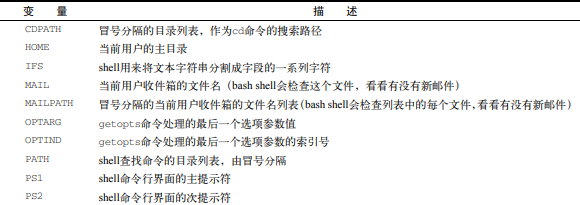
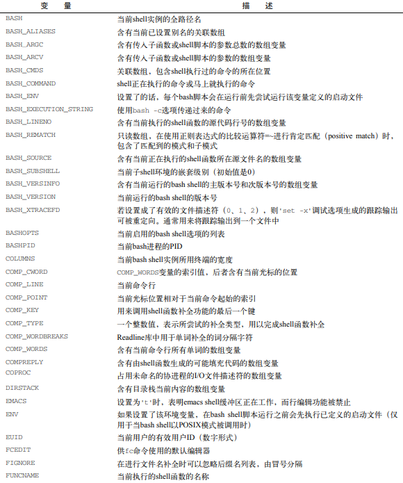
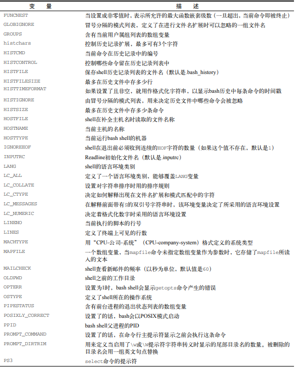
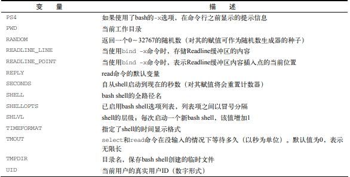

# 环境变量

## 系统默认环境变量






## 全局变量

> `shell` 会话及其所有子 `shell` 都可以使用全局变量

### 查看全局变量 - `env` | `printenv`

```bash
[root@server-test-211 kz]# env
XDG_SESSION_ID=2205
HOSTNAME=server-test-211
SELINUX_ROLE_REQUESTED=
TERM=xterm
SHELL=/bin/bash
HISTSIZE=1000
...
```

```bash
[root@server-test-211 kz]# printenv
XDG_SESSION_ID=2205
HOSTNAME=server-test-211
SELINUX_ROLE_REQUESTED=
TERM=xterm
SHELL=/bin/bash
...
```

### 查看某个环境变量 - `printenv` | `echo`

> `printenv [变量]` | `echo $[变量]`

```bash
[root@server-test-211 kz]# printenv SHELL
/bin/bash
```

```bash
[root@server-test-211 kz]# echo $SHELL
/bin/bash
```

## 局部变量

> 局部变量只能在当前 `shell` 会话（当前进程）中使用

### 查看局部变量 - `set`

> `set` 显示进程中的所有环境变量-全局变量、局部变量

```bash
[root@server-test-211 kz]# set
```

## 设置局部变量|用户定义变量

> 系统环境变量默认大写，自定义变量使用小写格式定义变量

```bash
[root@server-test-211 kz]# iuse='Hello'
[root@server-test-211 kz]# echo $iuse
Hello

```

```bash
[root@server-test-211 kz]# iuse=Hello-World
[root@server-test-211 kz]# echo $iuse
Hello-World

```

```bash
# 没有引号且包含空格时，会当成被 命令
[root@server-test-211 kz]# iuse=Hello World
bash: World: command not found...

```

## 设置全局变量

> 全局变量通过 `export` 局部变量到全局环境中。导出到全局环境的变量，不受局部变量修改的影响

```bash
[root@server-test-211 kz]# iuse='Hello World'
[root@server-test-211 kz]# export iuse
```

```bash
# 查看是否已写入全局环境
[root@server-test-211 kz]# printenv
XDG_SESSION_ID=2205
HOSTNAME=server-test-211
....
HOME=/root
iuse=Hello World

```

## 删除变量 - `unset`

```bash
[root@server-test-211 kz]# unset iuse
[root@server-test-211 kz]# echo $iuse


```

## 设置PATH环境变量

## 定位系统变量